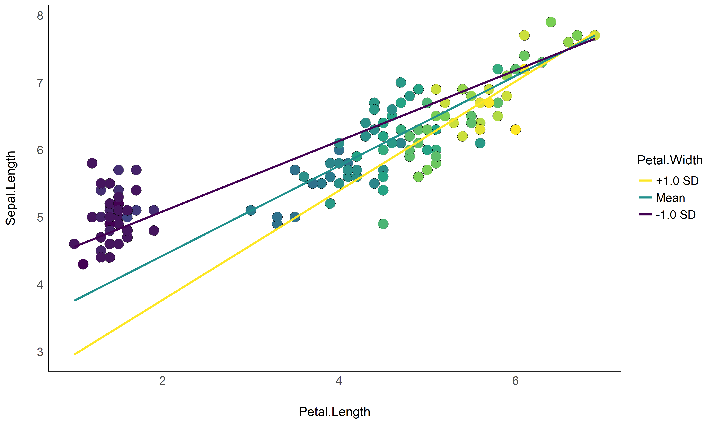
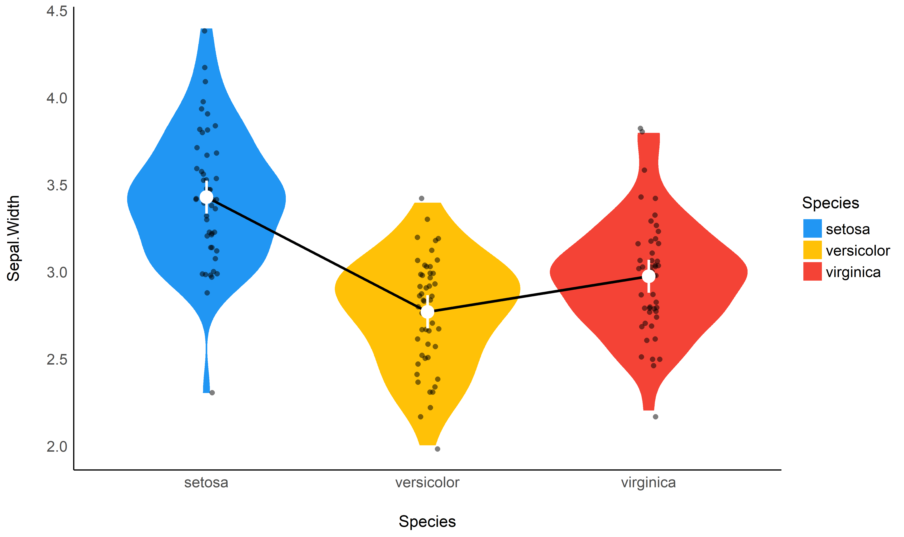
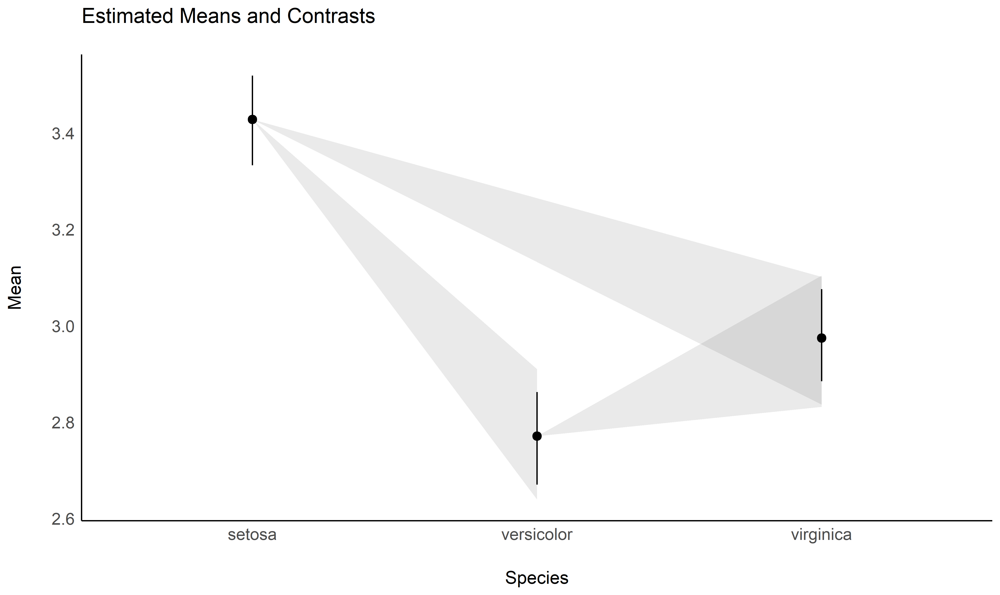

# modelbased 

[](https://cran.r-project.org/package=modelbased)
[](https://cran.r-project.org/package=modelbased)
[](https://codecov.io/gh/easystats/modelbased)

`modelbased` is a lightweight package helping with model-based
estimations, used in the computation of marginal means, contrast
analysis and predictions.

## Installation

Run the following:

``` r
install.packages("devtools")
devtools::install_github("easystats/modelbased")
```

``` r
library("modelbased")
```

## Documentation

[](https://easystats.github.io/modelbased/)
[](https://easystats.github.io/blog/posts/)
[](https://easystats.github.io/modelbased/reference/index.html)

Click on the buttons above to access the package
[**documentation**](https://easystats.github.io/modelbased/) and the
[**easystats blog**](https://easystats.github.io/blog/posts/), and
check-out these vignettes:

  - [**Visualisation
    matrix**](https://easystats.github.io/modelbased/articles/visualisation_matrix.html)
  - [**Marginal
    means**](https://easystats.github.io/modelbased/articles/estimate_means.html)
  - [**Contrast
    analysis**](https://easystats.github.io/modelbased/articles/estimate_contrasts.html)
  - [**Use a model to make
    predictions**](https://easystats.github.io/modelbased/articles/estimate_response.html)
  - [**Describe non-linear
    curves**](https://easystats.github.io/modelbased/articles/estimate_smooth.html)

# Features

The package is built around 5 main functions:

  - [`estimate_means()`](https://easystats.github.io/modelbased/reference/estimate_means.html):
    Estimates the average values at each factor levels
  - [`estimate_contrasts()`](https://easystats.github.io/modelbased/reference/estimate_contrasts.html):
    Estimates and tests contrasts between different factor levels
  - [`estimate_slopes()`](https://easystats.github.io/modelbased/reference/estimate_slopes.html):
    Estimates the slopes of numeric predictors at different factor
    levels
  - [`estimate_response()`](https://easystats.github.io/modelbased/reference/estimate_response.html):
    Predict the response variable using the model
  - [`estimate_smooth()`](https://easystats.github.io/modelbased/reference/estimate_smooth.html):
    Describes a non-linear term (*e.g.* in GAMs) by its linear parts

These functions are powered by the
[`visualisation_matrix()`](https://easystats.github.io/modelbased/reference/visualisation_matrix.html)
function, a smart tool for guessing the appropriate reference grid.

The package currently only supports `rstanarm` models, but will be
expanded to cover a large variety of frequentist and Bayesian models.

## Examples

### Create smart grids to represent complex interactions

Check-out [**this
vignette**](https://easystats.github.io/modelbased/articles/visualisation_matrix.html)
to create this plot:

<!-- -->

### Estimate marginal means

Check-out [**this
vignette**](https://easystats.github.io/modelbased/articles/estimate_means.html)
to create this plot:

<!-- -->

``` r
library(rstanarm)

model <- stan_glm(Sepal.Width ~ Species, data = iris)

estimate_means(model)
```

    ## Species    | Mean |       95% CI
    ## --------------------------------
    ## setosa     | 3.43 | [3.33, 3.52]
    ## versicolor | 2.77 | [2.68, 2.87]
    ## virginica  | 2.97 | [2.88, 3.07]

### Contrast analysis

Check-out [**this
vignette**](https://easystats.github.io/modelbased/articles/estimate_contrasts.html)
to create this plot:

<!-- -->

``` r
estimate_contrasts(model)
## Level1     |     Level2 | Difference |         95% CI |     pd | % in ROPE | Difference (std.)
## ----------------------------------------------------------------------------------------------
## setosa     | versicolor |       0.66 | [ 0.52,  0.78] |   100% |        0% |              1.50
## setosa     |  virginica |       0.45 | [ 0.31,  0.58] |   100% |        0% |              1.04
## versicolor |  virginica |      -0.20 | [-0.34, -0.07] | 99.78% |     6.95% |             -0.47
```

### Check the contrasts at different points of another linear predictor

``` r
model <- stan_glm(Sepal.Width ~ Species * Petal.Length, data = iris)

estimate_contrasts(model, modulate = "Petal.Length", length = 3)
```

    ## Level1     |     Level2 | Petal.Length | Difference |        95% CI |     pd | % in ROPE | Difference (std.)
    ## ------------------------------------------------------------------------------------------------------------
    ## setosa     | versicolor |         1.00 |       1.67 | [ 1.06, 2.31] |   100% |        0% |              3.83
    ## setosa     |  virginica |         1.00 |       1.34 | [ 0.59, 2.05] | 99.95% |     0.05% |              3.08
    ## versicolor |  virginica |         1.00 |      -0.33 | [-1.25, 0.63] | 76.10% |    13.33% |             -0.75
    ## setosa     | versicolor |         3.95 |       1.65 | [ 0.76, 2.64] | 99.98% |     0.02% |              3.78
    ## setosa     |  virginica |         3.95 |       1.71 | [ 0.71, 2.70] | 99.98% |        0% |              3.92
    ## versicolor |  virginica |         3.95 |       0.06 | [-0.22, 0.35] | 66.27% |    47.70% |              0.14
    ## setosa     | versicolor |         6.90 |       1.62 | [-0.41, 3.68] | 93.70% |     2.30% |              3.71
    ## setosa     |  virginica |         6.90 |       2.07 | [ 0.03, 4.04] | 97.80% |     1.05% |              4.76
    ## versicolor |  virginica |         6.90 |       0.43 | [-0.11, 0.97] | 94.47% |     8.08% |              0.99

### Find a predictor’s slopes at each factor level

``` r
estimate_slopes(model)
## Species    | Median |       95% CI |     pd | % in ROPE | Median (std.)
## -----------------------------------------------------------------------
## setosa     |   0.36 | [0.01, 0.75] | 97.10% |     8.00% |          1.44
## versicolor |   0.36 | [0.19, 0.56] |   100% |     0.22% |          1.46
## virginica  |   0.23 | [0.08, 0.39] | 99.78% |     5.10% |          0.94
```

### Generate predictions from your model to compare it with original data

Check-out [**this
vignette**](https://easystats.github.io/modelbased/articles/estimate_response.html)
to create this plot:

<!-- -->

``` r
estimate_response(model)
```

| Sepal.Length | Species | Predicted | CI\_low | CI\_high |
| -----------: | :------ | --------: | ------: | -------: |
|          5.1 | setosa  |      1.48 |    0.95 |     1.96 |
|          4.9 | setosa  |      1.47 |    0.91 |     1.94 |
|          4.7 | setosa  |      1.41 |    0.92 |     1.91 |
|          4.6 | setosa  |      1.40 |    0.90 |     1.95 |
|          5.0 | setosa  |      1.45 |    0.94 |     2.01 |
|          5.4 | setosa  |      1.50 |    1.05 |     2.10 |

### Estimate the link between the response and a predictor

See [**this
vignette**](https://easystats.github.io/modelbased/articles/estimate_response.html)
to create this plot:


``` r
model <- stan_glm(Sepal.Width ~ poly(Petal.Length, 2), data=iris)

estimate_link(model)
```

| Petal.Length | Predicted | CI\_low | CI\_high |
| -----------: | --------: | ------: | -------: |
|         1.00 |      3.62 |    3.49 |     3.75 |
|         1.98 |      3.18 |    3.09 |     3.26 |
|         2.97 |      2.90 |    2.81 |     2.99 |
|         3.95 |      2.78 |    2.69 |     2.87 |
|         4.93 |      2.84 |    2.76 |     2.90 |
|         5.92 |      3.05 |    2.95 |     3.15 |
|         6.90 |      3.44 |    3.21 |     3.66 |

### Describe the smooth term by its linear parts

``` r
estimate_smooth(model)
## Part | Start |  End |   Size | Trend | Linearity
## ------------------------------------------------
## 1    |  1.00 | 4.08 | 52.50% | -0.01 |      0.94
## 2    |  4.08 | 6.90 | 47.50% |  0.01 |      0.93
```
